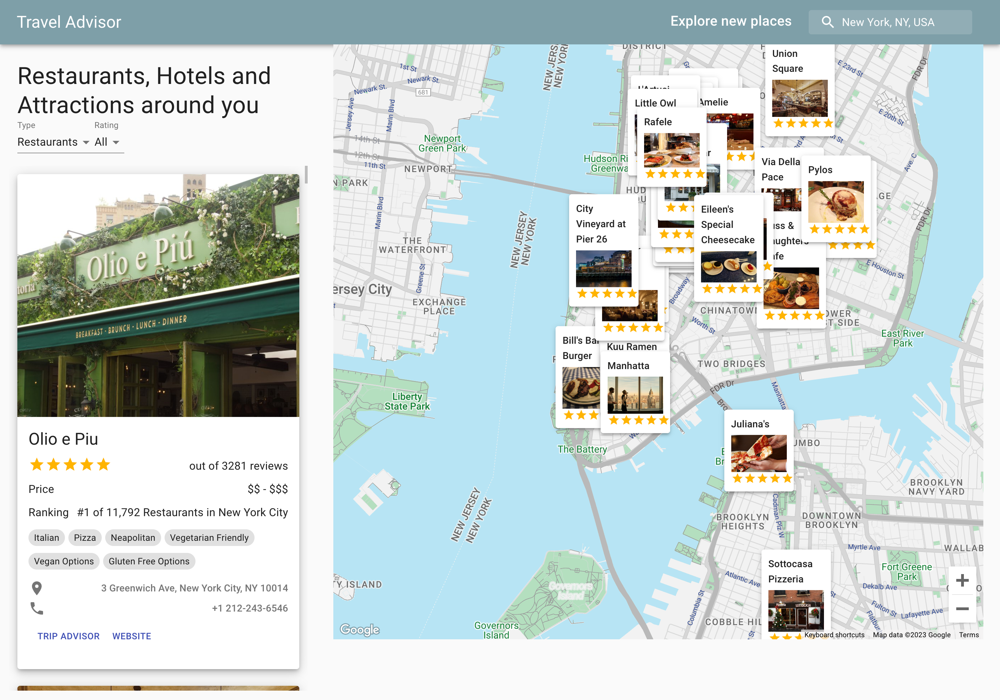

# TravelMate React App

Welcome to TravelMate, your go-to app for finding and sorting hotels, restaurants, and attractions based on their ratings. This app not only helps you discover exciting places but also presents them on an interactive map. Clicking on a location reveals crucial information such as star ratings, address, Trip Advisor link, official website, phone number, and price range.

## Features

- **Rating Sorting:** Easily sort hotels, restaurants, and attractions based on their ratings.
  
- **Interactive Map:** Visualize the locations on an interactive map for better planning.

- **Detailed Information:** Click on a place to view detailed information, including star ratings, address, Trip Advisor link, official website, phone number, popular cuisines and price range.




## Getting Started

Follow these steps to get TravelMate up and running on your local machine:

1. **Clone the Repository:**
   ```bash
   git clone https://github.com/your-username/TravelMate.git
   cd TravelMate

2. **Install Dependencies:**
   ```bash
   npm install

3. **Run the app:**
   ```bash
   npm start

The app will be accessible at http://localhost:3000 by default.

# Usage

## Homepage:

- Browse through the available categories: Hotels, Restaurants, and Attractions.
- Use the rating sorting feature to find the best-rated places.

## Interactive Map:

- Navigate to the Map view to see the locations visually.
- Click on the markers for a quick overview.
- Integrated Autocomplete searchbar that lets you jump to anywhere in the world.

## Detailed Information:

- Click on a location to view detailed information.
- Find important details like star ratings, address, Trip Advisor link, official website, phone number, popular cuisines and price range.

## Technologies Used

- React
- Material-UI
- Google Maps API
- Trip Advisor API
- Google Places API

Happy traveling with TravelMate! 🌍✈️


